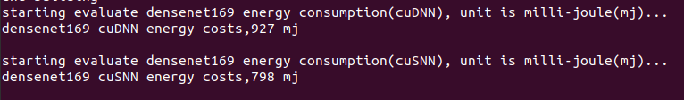
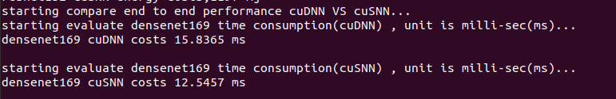
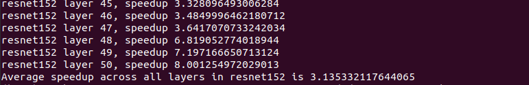

# AE High-performance Architecture Aware Sparse ConvolutionalNeural Networks for GPUs
## Package requirements:
* cmake(>=3.10)
* CUDA-10.2(V100)
* CUDA-11.0(2080Ti)
* Python3
* Tensorflow(optional)
## Setup
    export cuda_path=''
    export cuda_lib_path=''
    cuda_path is the absolute path(directory) where has the cuda headers. For me it is '/usr/local/cuda/include'
    cuda_lib_path is the absolute path(directory) where has the cuda library files. For me it is '/usr/local/cuda/lib64'

# Build code & Run experiments on V100 machine
  * cd v100
  * python3 run_v100.py(build and run)
  ## experiment 1
  it will report total energy consumption characteristics of different networks(densenet169,densenet201,resnet50,resnet152) on the V100 machine for both cuDNN and cuSNN. The unit is millijouel.
 
  
  ## experiment 2
  In experiment 2, we present the full network evaluation of different networks for both cuDNN and cuSNN. For the entire network evaluation, we include the time for all non-convolution and convolution layers. We use cuSNN kernels for sparse layers. The rest of the layers (dense convolution, batchnorm, relu, etc.) are built using cuDNN. 
  
  
 ## experiment 3
  In experiment 3, we we demonstrate the effectiveness of our approach by comparing the run-time of individual layers(densenet201&resnet152).
  
  
## Entire network evaluation for densenet(121, 169, 201), resnet(101, 152)
For the entire network evaluation, we include the time for all non-convolution and convolution layers. We use cuSNN kernels for sparse layers. The rest of the layers (dense convolution, batchnorm, relu, etc.) are built using cuDNN. Our entire network inference code takes a binary file representing the input images as input and outputs inference time and energy cost (mj )for the entire network.
 
# Build code & Run experiments on 2080Ti machine
  * cd 2080Ti
  * Pythone run_2080Ti.py
  * Note (2080Ti doesn't have energy consumption evaluation.)
  
# Note:
  Both energy and performance evaluation require pretrained model for each network. We have already put pretrained model weight for resenet and densent 
  in this repo. The user can test resnet/densent directly using our provided scripts. However, due to the size limit, we are not able to put the model weight for VGG here. If the user also want to evaluate VGG, we have provided weight downloader(get_weights.py) here. This downloader requires Tensorflow installed. Please go to (V100/2080Ti)/weights/(vgg16/vgg19), and run python3 get_weights.py to get the model weight for VGG. After get the weight, please uncomment the evaluation code for VGG in both run_2080Ti.py and run_v100.py.
    
# Benchmarking platform and Dataset 

## Machine 1: 
* GPU: Nvidia Volta V100(84 SMs, 32GB)
* OS:   Ubuntu 18.04.4 LTS
* CUDA: 10.2
* cuDNN: 7.6.5
* 
## Machine 2: 
* GPU: Nvidia GTX 2080 Ti (68 SMs, 11 GB)
* OS:  Ubuntu 20.04 LTS
* CUDA: 11.0
* cuDNN: 8.0.2

